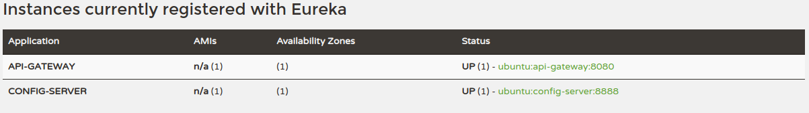

# feat: 001-build-msa
## 개요
- msa 구조 구현

## 변경사항
- api-gateway 
  - Spring을 기반으로 API를 구축하는 데 사용되는 Gateway
  - 클라이언트와 서비스 사이에 통신을 관리하는 역할
  - API 라우팅/필터링/로드밸런싱과 같은 역할 수행
  - 일부 경로에대해 필터적용위해 AbstractGatewayFilterFactory 추상 클래스 이용해 GatewayFilter 구현
  - jjwt 라이브러리 이용해 JWT 검증 구현 
- config-server 
  - 깃허브 레포지 토리와 비대칭 키 암호화 이용해 설정 파일 관리
  - 비대칭 암호화에 key-store 사용
- eureka-server 
  - 서비스 레지스트리와 서비스 디스커버리를 지원하기 위한 라이브러리
  - eureka server : Eureka Client들에게 가지고있는 Eureka Client들의 정보를 공유 Spring Cloud Gateway, Ribbon, Zipkin 등) 에서 이를 사용, 가용 상태의 서비스 목록 확인 시 서비스의 이름을 기준을 탐색, 로드밸런싱 위해 내부적으로 로드 밸런서 사용
  - eureka client : 서비스 시작시 Eureka Server에 자신의 정보 등록, 레지스트리로부터 다른 Eureka Client의 서비스 정보를 확인 가능
  - 
## 리뷰 요청
