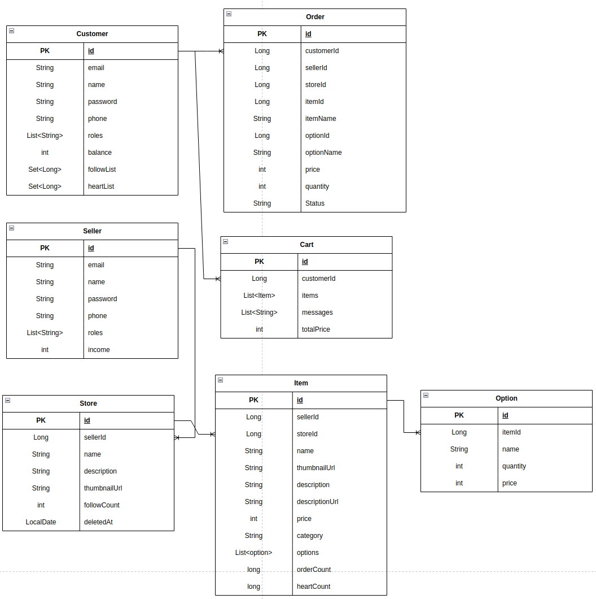
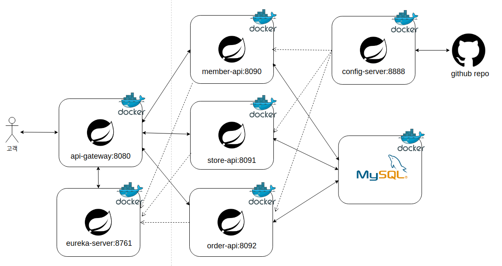
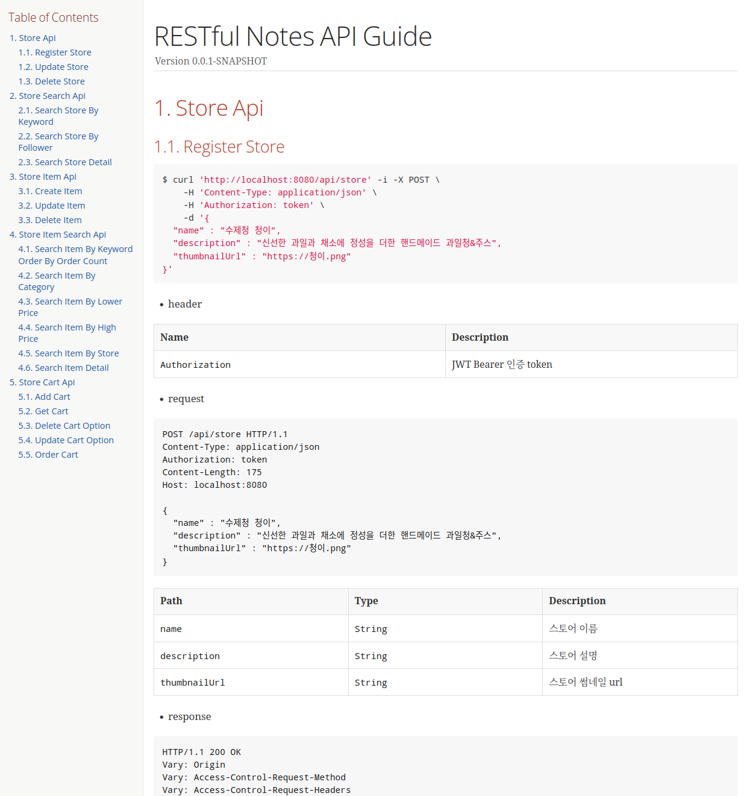
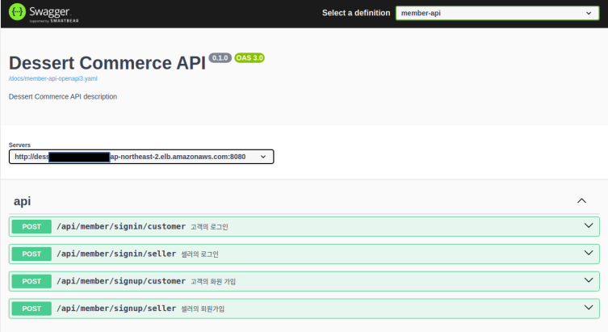
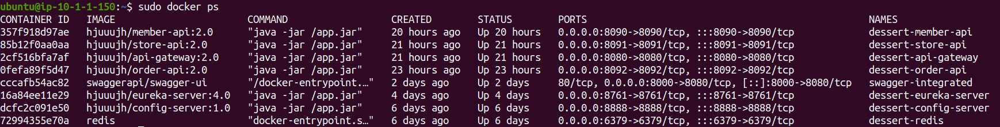
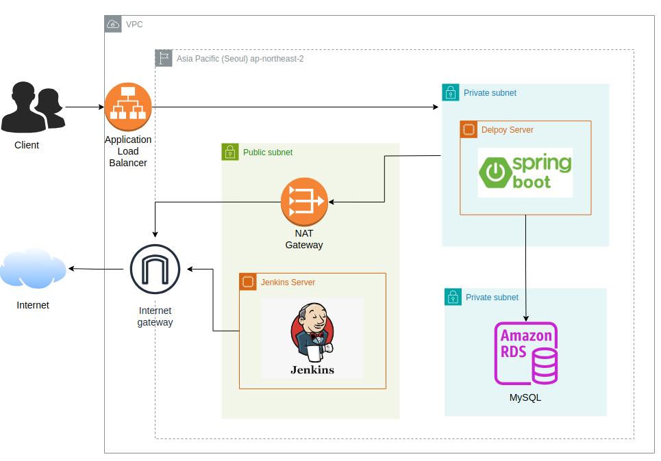
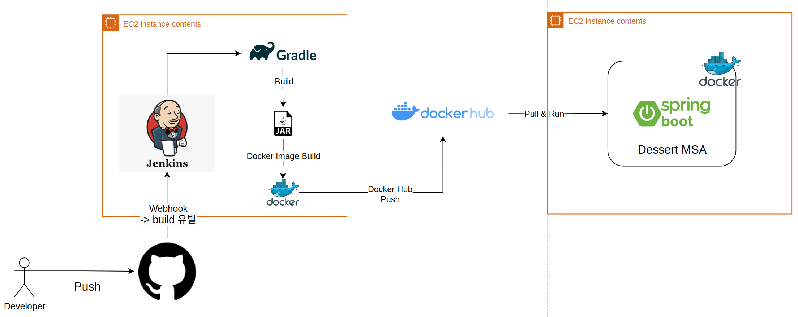

## 커머스 서비스
직접 만든 디저트를 판매하거나 구매할 수 있는 서비스입니다.

## 프로젝트 소개
- 주제 선정 이유 
  - 부트캠프에서 공부한 기술들을 개인 프로젝트에 적용해보고자 하였고 이커머스 프로젝트를 개발해보는 것이 적합하다고 생각 
  
- 기능
  - 회원가입 & 로그인
  - 잔액 충전 
  - 스토어 등록/수정/삭제/검색 
  - 스토어내 아이템 등록/수정/삭제/검색
  - 스토어 팔로우/언팔로우
  - 아이템 하트/하트 취소
  - 장바구니 등록/수정/삭제/조회
  - 장바구니 주문
  - 주문 내역 조회/환불
  - 판매 내역 조회/환불 수락/환불 거절 
  - 정산 
  
- ERD


## 개발 환경
- Ubuntu
- IntelliJ
- Spring Boot
- MySQL
- Redis
- Docker & Docker Compose
- Jenkins
- AWS
- Terraform
- Github

## 사용 기술 
- [Spring Cloud](#spring-cloud)
- [Spring AOP & Redisson](#spring-aop--redisson)
- [Spring Batch](#spring-batch)
- [Redis](#redis)
- [Spring REST Docs & Open API](#spring-rest-docs--open-api)
- [Docker & Docker Compose](#docker--docker-compose)
- [AWS](#aws)
- [Jenkins](#jenkins)

### Spring Cloud
- 사용 이유 
  - 프로젝트 규모가 커지면서 기존 모놀리틱 방식으로 개발한 서비스는 한 서비스에서 에러가 발생하면 다른 서비스에도 장애가 발생하는 불편한 경험    
  ➡️  서비스를 분리해 개발할 필요성을 느껴 현업에서도 많이 사용되는 MSA로 구성된 프로젝트를 구현해보기로 결정  
  ➡️  Spring 에서 MSA 개발을 위해 제공하는 Spring Cloud를 사용해 구현  
  
- 구조


- 구현 
  - Spring Cloud Gateway (api-gateway) : Spring 생태계를 기반으로 하는 API Gateway를 제공, AuthorizationHeaderFilter를 이용해 jwt 토큰인증 & 권한 확인        
  - Spring Cloud Config (config-server) : 분산 시스템에서 외부화된 설정 정보를 서버 및 클라이언트에게 제공, 공개하면 안되는 설정 정보들은 비대칭키 방식(JDK Keytool) 이용해 관리
  - Spring Cloud Netflix - Eureka Server (eureka-server) : service discovery 역할, 어플리케이션의 서로간 통신에 이용      
  - member-api : 회원 정보 관련 어플리케이션   
  - store-api : 상점/아이템 관련 어플리케이션        
  - order-api : 주문/정산 관련 어플리케이션 

- 개선점 
  - 분산 추적, 모니터링 기능
  - Circuit Breaker 사용해 전체 서비스 속도 저하,  중단 방지 

### Spring AOP & Redisson
- 사용 이유
  - 고객의 포인트 충전/차감/환불시 동시성 문제를 해결할 방법 필요 
  - redis와 redisson에서 분산락을 이미 구현하여 제공해 별도의 구현 로직이 필요하지 않고 부하가 적기때문에 이용
  - 고객의 포인트에 접근할때마다 lock을 사용하기보다는 AOP를 이용해 분리하는 것이 핵심 로직을 오염시키지 않는 방법  
  ➡️  interface를 구현해 고객의 포인트에 접근하는 요청이 있는 컨트롤러에 적용
  
- 구현 
  - @interface, @Aspect, @Around 이용
  - log에 lock 취득 기록 및 확인
  - ```2024-09-22 17:43:42.616  INFO 49168 --- [nio-8090-exec-1] c.z.memberapi.service.LockService        : Trying lock for email : user2@gmail.com```

### Spring Batch
- 사용 이유
  - 현업에서는 구매후 바로 판매자에게 입금되기보다는 기간별로 정산
  - 일정 기간동안 쌓인 많은 데이터를 처리할 방법 필요  
  ➡️  Spring Batch를 이용해 매일 새벽 4시 판매자별 수익을 합산해 정산테이블에 저장 후 판매자가 기간별 정산을 요청하는 방식으로 구현 
  
- 구현
  - 오더시스템에서 주문관련 데이터베이스와 배치 데이터베이스를 분리
  - group by 이용해 판매자 아이디별로 전날 수익을 합산하는 쿼리 생성    
  - JdbcTemplate.batchUpdate 이용해 쓰기 속도 향상
  - Scheduler이용해 새벽 4시에 Batch Job 실행하도록 스케줄러 추가 
      
- 개선점
  - group by, sum이용시 데이터베이스 부하증가  
  ➡️  redis등 다른 기술 이용한 성능 개선 필요 
  
### Redis
- 사용 이유 
  - 장바구니 서비스를 구현 
  - 사용하는 데이터 베이스인 MySQL 이용시 장바구니 수정은 빈번히 일어나는 이벤트이기 때문에 속도저하  
  ➡️  in memory DB인 Redis를 이용하기로 결정 

- 구현
  - Redis 도커 이용해 구축
  - RedisTemplate 이용
  - customerId를 키로 이용해 아이템과 옵션을 저장
  - 장바구니에 담은 옵션의 정보가 변경된 경우 카트의 메세지에 추가해 카트 조회시 확인 가능
  - 주문시 주문하지 않은 아이템과 옵션은 장바구니에 남아있도록 구현

### Spring REST Docs & Open API
- 사용 이유
  - 현재는 백엔드만 개발하고있지만 프론트 엔드에서 API를 이용할때 소통이 필요
  - 기존에 사용하던 Swagger은 부가적인 코드들로 인해 구현 내용을 파악하기 어렵게 만든다고 생각
  ➡️  비즈니스 코드와는 분리되어 가독성을 상승시키고 테스트 작성을 통해 신뢰도를 상승시키는 REST Docs를 이용
  ➡️  REST Docs를 생성하고보니 API Test를 지원하지 않는점이 불편할 수도 있다고 생각
  ➡️  OpenApi는 테스트 코드를 통핸 신뢰도 상승과 비즈니스 코드와의 분리, API Test도 해볼 수 있기때문에 사용

- 구현
  - REST Docs
    
  - OpenAPI 
  - restdocs-api-spec 이용해 테스트코드 작성
    

### Docker & Docker Compose
- 사용 이유
  - 애플리케이션을 효율적으로 개발, 배포, 실행하고 다양한 환경에서 동일한 방식으로 동작하기 때문에 docker를 사용
  - docker container를 편하게 생성하고 MSA로 구성한 프로젝트에서 컨테이너끼리의 연결을 쉽게 하도록 docker compose를 사용  
  
- 구현
  - 서비스마다 Dockerfile 작성
  - 프로젝트에 docker-compose.yml 작성 
  
  
- 개선점
  - 이미지 경량화 
  
### AWS
- 사용 이유
  - 개발한 서비스 배포하기위해 가장 많이 사용하는 클라우드 컴퓨팅 서비스인 AWS 사용 
  
- 구현 
  
- [AWS 서버 구축 과정](https://awesome-saxophone-bf8.notion.site/AWS-105ad1d5fb0b807f895bca13d61fb224)

- 개선점
  - bastion host 추가해 Jenkins를 private subnet으로 이동
  - 젠킨스 ec2 & 배포서버 ec2의 적절한 볼륨사이즈 지정 필요 
  - swagger-ui 응답 수정 필요
  
### Jenkins
- 사용 이유
  - 서비스에 수정 사항이 생길때마다 직접 재배포 하는 과정에서 불편함을 느낌
  - Jenkins를 이용해 자동으로 배포하도록 결정
  
- 구현 
  
- [Jenkins Pipeline 구축 과정](https://awesome-saxophone-bf8.notion.site/Jenkins-Pipeline-105ad1d5fb0b80ac9d83e919ea144d06)
  
- 개선점
  - 무중단 배포 : 현재 배포원하는 서비스의 컨테이너 중단후 새로운 이미지 받아 컨테이너 재시작하고 있음

## 상세 기능
- [상세 기능](https://awesome-saxophone-bf8.notion.site/5ac40a6218b14a8eae6e35f750a1dfe6?pvs=25)

## 피드백 
- [멘토링 통해 받은 피드백과 수정 내용](https://awesome-saxophone-bf8.notion.site/107ad1d5fb0b8098a403c1cdf6cf46ac)


	
