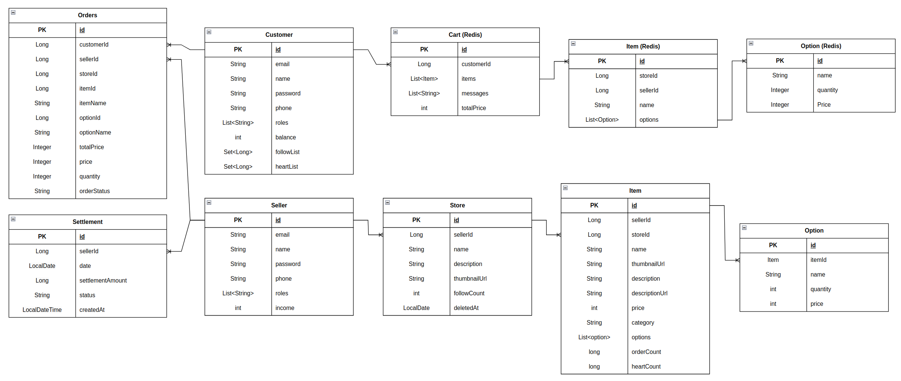

## 커머스 서비스
직접 만든 디저트를 판매하거나 구매할 수 있는 서비스입니다.

## 프로젝트 구조
- Spring Cloud Eureka Server로 마이크로 서비스 애플리케이션 구현
    - api-gateway : AuthorizationHeaderFilter를 이용해 jwt 토큰인증 & 권한 확인
    - config-server : 공개하면 안되는 설정 정보들을 비대칭키 방식(JDK Keytool) 이용해 관리
    - eureka-server : service discovery 역할, 어플리케이션의 서로간 통신에 이용
    - member-api : 회원 정보 관련 어플리케이션
    - store-api : 상점/디저트 관련 어플리케이션
    - order-api : 주문 관련 어플리케이션
    - 
## 프로젝트 기능 및 설계
- 회원가입 기능
    - 사용자는 고객/셀러중 가입가능하며 다른 권한을 가진다.
    - 회원가입시 이메일과 비밀번호를 입력받으며 이메일은 중복확인을 거친다.
    - 비밀번호는 암호화하여 저장한다.
- 로그인 기능
    - 로그인시 회원가입때 사용한 아이디와 패스워드가 일치해야한다.
- 잔액 충전 기능
    - 이메일과 충전 금액을 입력받는다.
    - 제품 구매를 위한 포인트를 충전한다.
    - aop와 reddison을 이용해 계좌에 락을걸어 동시성을 제어한다.
- 매장 팔로우/언팔로우 기능
    - 매장id를 입력받는다.
    - 팔로우 리스트에 매장id를 추가하거나 삭제한다.
    - 매장의 팔로우 카운트를 증가하거나 감소한다.
- 아이템 찜/취소 기능
    - 아이템id를 입력받는다.
    - 찜 리스트에 아이템id를 추가하거나 삭제한다.
    - 아이템의 찜 카운트를 증가하거나 감소한다.
- 매장 정보 등록 기능
    - 매장명, 설명을 입력받는다.
    - 매장명은 중복확인을 거친다.
- 매장 정보 변경 기능
    - 매장id, 매장명, 설명을 입력받는다.
    - 매장명은 중복확인을 거친다.
- 매장 삭제 기능
    - 매장id를 입력받는다.
    - 매장의 delete 컬럼을 false로 변경한다.
    - 팔로우한 고객의 팔로우 리스트에서 매장id를 삭제한다.
- 매장 검색 기능
    - 로그인을 하지 않아도 검색은 가능하다.
    - 키워드 검색, 팔로우순 검색을 제공한다.
    - 찾은 데이터가 많을 수 있으므로 paging 처리를 한다.
- 제품 등록 기능
    - 매장id, 제품명, 제품설명, 옵션리스트를 입력받는다.
    - 아이템명은 스토어내에서 중복 불가능하다.
    - 옵션리스트에서 옵션명은 중복 불가능하다.
    - 옵션리스트에서 가격, 수량이 적절한지 확인한다.
- 제품 업데이트 기능
    - 제품id, 매장id, 제품명, 제품설명, 옵션리스트를 입력받는다.
    - 아이템명은 스토어내에서 중복 불가능하다.
    - 옵션리스트에서 옵션명은 중복 불가능하다.
    - 옵션리스트에서 가격, 수량이 적절한지 확인한다.
    - 옵션은 기존 아이템의 옵션들을 삭제한 후 새로운 옵션을 만들어 아이템에 추가하는 방식으로 진행한다.
- 제품 삭제 기능
    - 제품id를 입력받는다.
    - 제품 옵션들은 ManyToOne 관계로 제품이 삭제되면 옵션들도 삭제된다.
- 제품 검색 기능
    - 로그인을 하지 않아도 검색은 가능하다.
    - 찾은 데이터가 많을 수 있으므로 paging 처리를 한다.
    - 검색한 키워드를 포함한 제품들내에서 필터를 적용한다.
    - 기본 키워드 검색은 주문순으로 정렬한다.
    - 최신순/낮은가격순/높은가격순으로 검색 가능하다.
- 장바구니 추가 기능
    - 장바구니는 Redis를 이용한다.
    - 아이템 리스트를 입력받는다.
- 장바구니 확인 기능
    - 담은 아이템의 정보가 변경된경우 메세지를 포함해 리턴한다.
- 장바구니 수정/삭제 기능
    - 아이템 리스트를 입력받는다.
    - 기존 장바구니를 삭제하고 새로운 장바구니를 생성해 수정/삭제를 구현한다.
- 주문 기능
    - 장바구니를 기준으로 주문한다.
    - 고객의 포인트가 충분한지 확인한다.
    - 옵션의 잔여수량을 감소한다.
    - 아이템의 주문횟수를 증가한다.
    - 고객의 포인트를 감소시켜 결제를 진행하고 성공/실패 결과를 트랜잭션 테이블에 저장한다.
    - 오더 테이블에 옵션별 총 가격과 수량을 저장한다.
## ERD

	